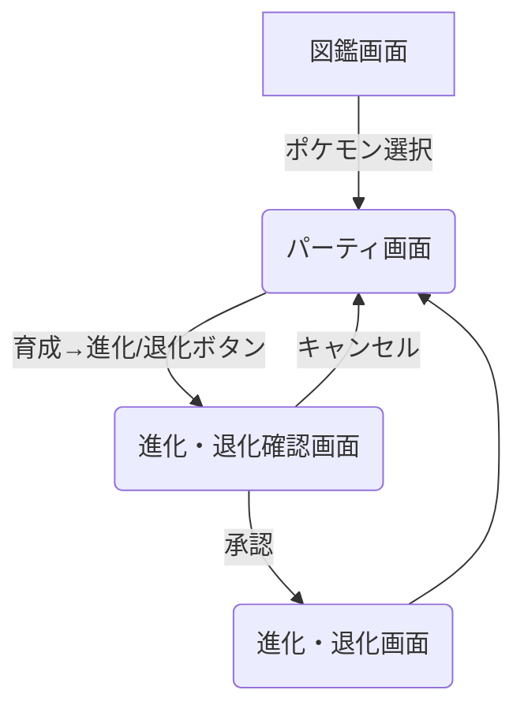

# アプリケーション仕様書

## 概要

### 目的

本アプリケーションは、Flutter のアーキテクチャ設計・実装の学習を目的としたサンプルアプリケーションである。
状態管理が比較的複雑になるような要件を盛り込み、実践的な開発スキルを習得することを目指す。

### アプリケーション名

Pokemon Breeder App

## 機能仕様

### 機能一覧

| No. | 機能名       | 概要                                                              |
| :-- | :----------- | :---------------------------------------------------------------- |
| 1   | ポケモン図鑑 | PokeAPI を利用してポケモンの情報を一覧表示する。                  |
| 2   | ポケモン検索 | 図鑑内のポケモンを名前で検索できる。                              |
| 3   | パーティ編成 | 図鑑からポケモンを 6 匹まで選択し、自分のパーティとして編成する。 |
| 4   | ポケモン育成 | パーティ内のポケモンを育成（進化・退化）させる。                  |

### 機能詳細

#### ポケモン図鑑 (機能 No.1)

- PokeAPI からポケモンデータを取得し、リスト形式で表示する。
- 無限スクロール（ページネーション）を実装し、ユーザーがスクロールするたびに新しいポケモンデータを読み込む。
- 各ポケモンには、名前、ID、画像（スプライト）を表示する。
- リストの各項目をタップすると、ポケモンの詳細画面に遷移する（詳細画面は本仕様の対象外とするが、拡張性を考慮する）。

#### ポケモン検索 (機能 No.2)

- 図鑑画面に検索フィールドを設ける。
- ポケモン名か図鑑番号で完全一致検索を行う。
- 検索結果をリアルタイムで図鑑リストに反映させる。

#### パーティ編成 (機能 No.3)

- 図鑑のポケモンを選択し、最大 6 匹のパーティを編成できる。
- 現在のパーティは「パーティ」画面で確認できる。
- パーティの情報はローカルデータベースに永続化する。
- パーティにポケモンを追加・削除する機能を提供する。

#### ポケモン育成 (機能 No.4)

- 「パーティ」画面で、各ポケモンを育成できる。
- 各ポケモンに育成カウンター（進化用と退化用）を設け、それぞれを規定回数タップすると進化・退化する。
- 進化・退化ができない場合は該当のカウンターが非活性表示になる。
- 進化・退化する際は専用の画面に遷移し、承認すると進化・退化する。
- ローカル DB で管理する。

## 画面仕様

### 画面一覧

- **図鑑画面**: ポケモン一覧を表示するメイン画面。検索機能も含む。
- **パーティ画面**: 編成したパーティのポケモン 6 匹を表示し、育成を行う画面。
- **進化・退化確認画面**: ポケモンの進化または退化を実行する前に、最終確認を行う画面。
- **進化・退化画面**: ポケモンが進化または退化したことを表示する画面。

### 画面遷移図

## 非機能要件

### Flavor 対応

- `dev` と `prod` の 2 つの Flavor を設ける。
- `dev` の場合は、デバッグ用の仕様や表示にする。

### オフライン対応

- ネットワーク接続がない状態でアプリを起動、または操作した場合、その旨を伝えるダイアログを表示し、他の操作はできないようにする。

### ローディング表示

- API 通信中やデータの読み込み中など、待ち時間が発生する場面では、スケルトンローディング（Shimmer エフェクトなど）を表示し、UX の低下を防ぐ。
